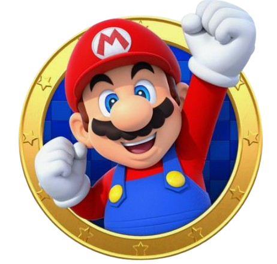
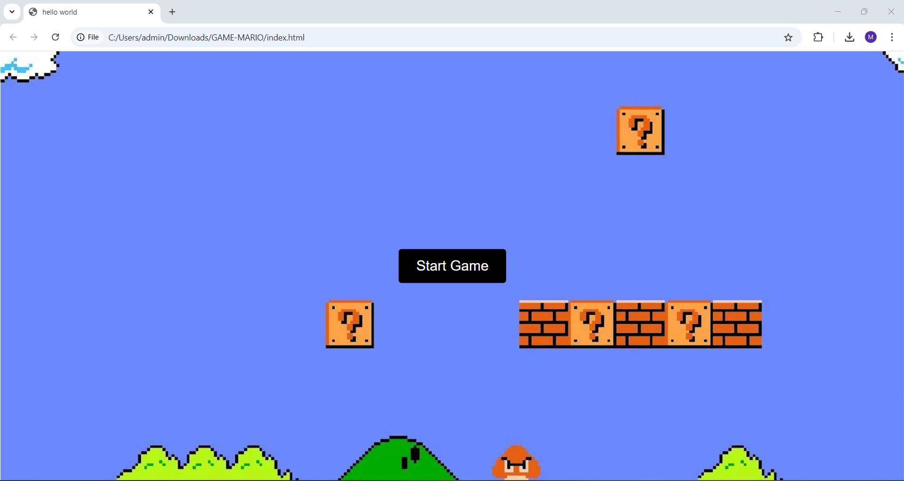
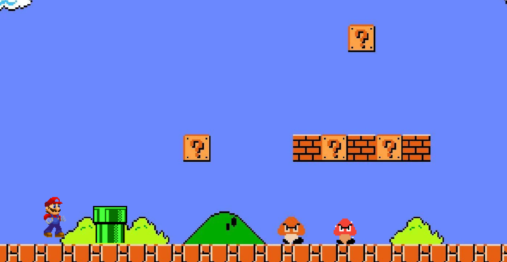

    

# 🎮 Mario-Run

Welcome to A classic Mario Run game, a simple and fun endless runner game inspired by the classic Mario universe! 🏃‍♂️ Help Mario navigate through obstacles, collect coins, and go as far as you can!

## DESCRIPTION 📑

**Do you ever find yourself longing for the good old days of classic Mario games—those carefree moments spent running, jumping, and collecting coins in vibrant, pixelated worlds?**

If so, Mario Run is here to rekindle that nostalgia with a fresh and exciting twist! Step back into Mario’s familiar universe, where the charm of retro gaming meets the thrill of an endless runner. Relive the magic of those childhood adventures as you guide Mario through a fast-paced, obstacle-filled journey. Every jump over an enemy, every coin you collect, and every near-miss will remind you of the simple yet unforgettable joy that made Mario an icon. Whether you're yearning to relive your favorite moments or introduce a new generation to the magic, Mario Run is the perfect blend of nostalgia and modern excitement!

## 🚀 Features

**👩‍💻 Features:**
1. Classic Mario experience: Relive the nostalgia with a simple 2D Mario Run.
2. Endless running: Play for as long as you can survive, with increasingly difficult obstacles!
3. Coin collection: Earn points by collecting coins along the way.
4. Smooth controls: Jump and move easily with intuitive controls.
5. Responsive design: Enjoy on various screen sizes, optimized for desktop and mobile.

**🌻 How to Play:**

1. Run: Mario automatically runs forward.
2. Jump: Press the spacebar (or tap on mobile) to jump over obstacles.
3. Collect Coins: Collect as many coins as possible to increase your score.
4. Avoid Obstacles: Don’t run into enemies or obstacles, or the game will be over!

## 💡 TechStacks:

**Frontend**:

1. HTML5: For structuring the game.
2. CSS3: For styling and animations.
3. JavaScript: For game logic and interactivity.
4. Canvas API: For rendering the game visuals.

**Development tools**:

1. VS Code: A robust code editor for development.
2. Git: Version control for tracking changes and collaborating.
3. GitHub: Hosting the project and managing collaboration.

## ⚙️ Installation:

To clone and run this project locally:

1. Clone the repo:

git clone https://github.com/your-username/mario-run.git

2. Navigate to the project folder:

cd mario-run

3. Open the index.html file in your browser to start playing the game.

## 👩‍💻 Future Improvements:

1. Add more levels and different environments.
2. Introduce power-ups and special abilities.
3. Improve animations and visual effects.
4. Leaderboard feature to track top scores.

## 📷 Screenshots:

    
    

## 🌻 Support the Project

If you find this project helpful, please consider giving it a star on GitHub! Your support helps to grow the project and reach more contributors.

## 🤝 Contributions

Contributions are welcome! Feel free to open an issue or submit a pull request with improvements or new features.

## 📧 Contact

For any inquiries or feedback, please contact Mansi Ruhil at [LinkedIn](https://www.linkedin.com/in/mansi-ruhil-7a00a0228/).
